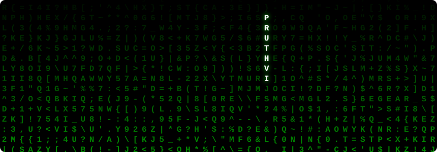
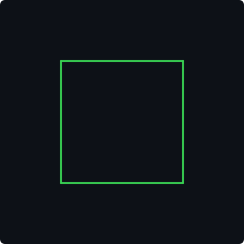

<!-- Phase 1: The Master Banner -->
<picture>
  <source media="(prefers-color-scheme: dark)" srcset="./dark.svg">
  
</picture>

  

<!-- Phase 4: Social Badges -->
&nbsp;&nbsp;
&nbsp;&nbsp;
&nbsp;&nbsp;

  

<!-- Phase 2: Professional Stats -->
<picture>
  <source media="(prefers-color-scheme: dark)" srcset="https://streak-stats.demolab.com/?user=pruthvi828&hide_border=true&background=0A101F&stroke=22D3EE&ring=A78BFA&fire=10B981&currStreakLabel=22D3EE&sideLabels=94A3B8&currStreakNum=F8FAFC&sideNums=F8FAFC&dates=64748B&titleColor=22D3EE&card_width=1180" />
  
</picture>

 

<picture>
  <source media="(prefers-color-scheme: dark)" srcset="https://github-readme-stats.vercel.app/api?username=pruthvi828&show_icons=true&count_private=true&include_all_commits=true&hide_rank=true&hide_border=true&title_color=22D3EE&icon_color=A78BFA&text_color=94A3B8&bg_color=0A101F&card_width=500" />
  
</picture>
<picture>
  <source media="(prefers-color-scheme: dark)" srcset="https://github-readme-stats.vercel.app/api/top-langs/?username=pruthvi828&layout=compact&hide_border=true&title_color=22D3EE&icon_color=A78BFA&text_color=94A3B8&bg_color=0A101F&card_width=500" />
  
</picture>

  

<!-- Phase 3: The Snake Game -->
<picture>
  <source media="(prefers-color-scheme: dark)" srcset="./github-snake.svg">
  
</picture>

  

<!-- The Crazy Stuff -->

  
<h2>💻 Experimental Visuals (Click to expand)</h2>

  
  <h3>Animated Contribution Heatmap</h3>
  
  
    

  <h3>Matrix Digital Rain (Pure SVG CSS)</h3>
  
  
    
  
  <h3>Animated PCB Component</h3>
  <table>
      <tr>
      <td valign="top"></td>
      <td valign="top"></td>
      </tr>
  </table>

    
  
  <h3>3D Rotating Cube (Math inside SVG SMIL)</h3>
  
  

